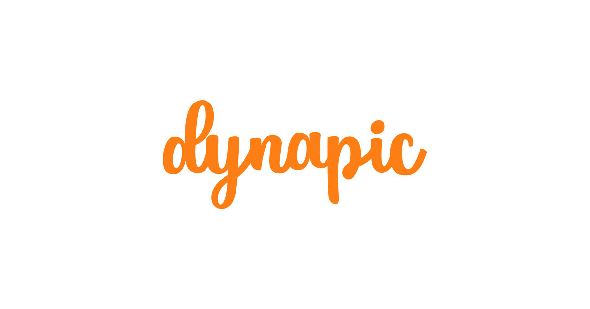

<p align="center">
  
</p>

> Dynapic is a tool for generating images with dynamic content. You can use it to generate headers or profile pictures for your Social Media profiles, Open Graph images for each one of your blog posts, or any other picture with dybamic data to embed wherever you want.

## Tech Stack

### Infrastructure

- [Railway](https://railway.app): infrastructure-as-a-service that allows to deploy and provision databases for different environments.

### Main Technologies

- [TypeScript](https://www.typescriptlang.org/): Type-safety for JavaScript
- [React.js](https://reactjs.org/): UI library
- [Remix](https://remix.run): Full-stack React Framework

### Supporting Technologies

- [Metronome](https://metronome.sh/): Analytics for Remix projects
- [Mantine](https://mantine.dev): Component library for React
- [Framer Motion](https://www.framer.com/motion/): Animation library for React
- [Radix Icons](https://icons.modulz.app/): Crisp set of 15x15 icons designed by the [Modulz](https://modulz.app) team.

## Development Guidelines

> [VSCode Remote Containers](https://code.visualstudio.com/docs/remote/containers) is used to create an isolated development environment and avoid conflicts with other locally installed tools.

### System Requirements

- [Docker](https://docker.com)
- [Git](https://git-scm.com/)
- [Visual Studio Code](https://code.visualstudio.com/)

### Cloning the project

#### Using the `gh` CLI:

```sh
gh repo clone elkevinwolf/dynapic
```

#### Using `https`:

```sh
git clone https://github.com/elkevinwolf/dynapic.git
```

#### Using `ssh`:

```sh
git clone git@github.com:elkevinwolf/dynapic.git
```

### Opening the Development Container

Open the cloned project in VS Code. Once you open it, you will see a popup with the text `Folder contains a Dev Container configuration file. Reopen folder to develop in a container.`, click the `Re-open in Container` button and a new Docker container will be created and dependencies will be automatically installed for you.

### Running the Development Server

With the project open in the Development Container, open the VSCode Integrated Terminal and enter `npm run dev`. Navigate to http://localhost:3000 and you will see the application up and running.

### Contributing

1. Create a new branch off of `main`
2. Work on your changes, create as many commits as you need
3. Open a Pull Request and set `main` as your base branch
4. Once it has been approved and tested, it will be **squash-merged** into `main` and your changes will be live 🚀

### Code Conventions

[Prettier](https://prettier.io) with the [`@elkevinwolf/prettier-config`](https://www.npmjs.com/package/@elkevinwolf/prettier-config) config and [ESlint](https://eslint.org) with the [`@elkevinwolf/eslint-config-react`](https://www.npmjs.com/package/@elkevinwolf/eslint-config-react) are used to ensure good and concise coding standards.

### Commit conventions

All commits in the `main` branch should follow the [Conventional Commits specification](https://www.conventionalcommits.org/en/v1.0.0/).

Commits in other branches or Pull Requests doesn't need to follow the convention, since they will eventually be **squash-merged** into `main` using the above convention.

### Continuous Integration / Continuous Deployment

Whenever a push happens, a [GitHub Action](./.github/workflows/validate.yml) will validate the code, by building, linting, and testing the application.

The `main` branch points to the production environment in [Railway](https://railway.app), while Pull Requests will provision temporary environments for testing.
